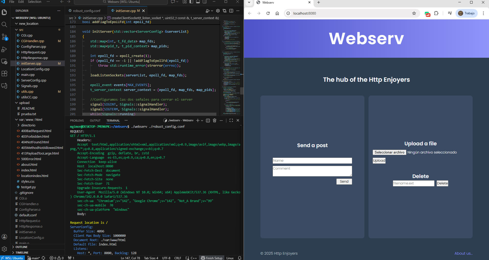

# Webserv

"Webserv" is a project focused on implementing a fully functional HTTP server using C++98.  
It offers the opportunity to understand how HTTP operates internally, how browsers request resources, and how a server manages non-blocking connections, requests, and responses according to the protocol.

## 🟠 Demo



---

## 🟠 Overview

The project implements a real HTTP server, testable with standard web browsers or tools such as `curl` and `telnet`.  
It covers advanced concepts including:

- socket programming  
- non-blocking I/O  
- I/O multiplexing using `poll()`, `select()`, `kqueue()`, or `epoll()`  
- HTTP request parsing  
- routing and file serving  
- CGI execution  
- correct handling of HTTP protocol and status codes  

---

## 🟠 Requirements

The server must:

- Be **fully non-blocking**, including accepting clients and reading/writing on sockets.  
- Use **a single poll() (or equivalent)** to manage all server I/O.  
- **Never** read or write on a socket without poll indicating readiness.  
- Properly handle **client disconnections**.  
- Be compatible with **real browsers**.  
- Implement **GET**, **POST**, and **DELETE**.  
- Correctly serve a **fully static website**.  
- Support **file uploads** from clients.  
- Generate **default error pages** when none are provided.  
- Be able to listen on **multiple ports**.  
- Support at least **one CGI** (e.g., php-cgi, Python).  
- Remain stable under **stress testing** — no crashes, no blocking, no hangs.

---

## 🟠 Configuration file

The server must parse a configuration file inspired by NGINX.

It must be able to configure:

- `interface:port` pairs where the server listens  
- custom error pages  
- the maximum allowed client body size  
- route-specific rules, including:
  - allowed HTTP methods  
  - HTTP redirection  
  - root directory for the route  
  - directory listing (on/off)  
  - default file for directory requests  
  - file upload location  
  - CGI execution based on file extension  

---

## 🟠 Compilation

Execute:

```
make
```

and then

```
./webserv robust_config.conf
```

or any other custom configuration file

##

## 🔄 You may also like...

[-> My profile on the 42 Intranet](https://profile.intra.42.fr/users/mgimon-c)

[-> My LinkedIn profile](https://www.linkedin.com/in/mgimon-c/)

